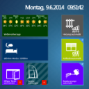

ioBroker.vis-playground
============

This is my widget playground set to create your own.

You can read instructions in playground.js, playground.html files

## Changelog

## License
 Copyright (c) 2015-2016 DeepCore System
 MIT
